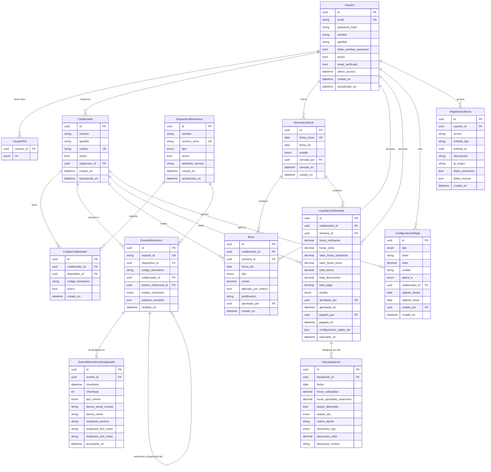

# Data Model: Modelo de Datos Relacional del MVP

**Feature**: 003-mvp-data-model | **Version**: 2.0 | **Date**: 2026-05-25
**Status**: APROBADO — modelo base v2.0 con enmiendas specs 005/007/009/011/006 incorporadas

---

## Registro de Enmiendas

| Versión | Fecha | Spec origen | Cambio |
|---------|-------|-------------|--------|
| 1.0 | 2026-05-22 | 003 | Modelo base inicial |
| 2.0 | 2026-05-25 | 005/009 | `usuarios`: eliminar campo `rol`, añadir `debe_cambiar_password`; nuevo enum `RolUsuario` (4 valores); nueva tabla `usuario_roles` (M:N) |
| 2.0 | 2026-05-25 | 007 | `liquidaciones_semanales`: añadir valor `PAGADO` a `EstadoLiquidacion`; campos `pagado_por`, `pagado_en` |
| 2.0 | 2026-05-25 | 011 | `eventos_biometricos`: añadir `evento_referencia_id` (auto-referencial); `EstadoResolucion` += `POTENCIAL_DUPLICADO`, `DUPLICADO`; `eventos_biometricos_desglosados`: añadir `tipo_evento` (nuevo enum `TipoEvento`); `TipoConfiguracion` += `DEDUP_WINDOW_MINUTES` |
| 2.0 | 2026-05-25 | 006 | `bonos`: añadir `fecha_dia`; `TipoBono` += `GENERICO`; nueva tabla `dias_liquidacion`; nuevos enums `EstadoDia`, `TipoDescuentoDia` |

---

## Diagrama Entidad-Relación

---

## Diccionario de Datos

### `usuarios`

> **Enmienda v2.0 (spec 005/009)**: Eliminado campo `rol`. Añadido `debe_cambiar_password`. La relación de roles pasa a ser M:N via tabla `usuario_roles`.

| Campo | Tipo DB | Prisma | Nullable | Único | Default | Descripción |
|---|---|---|---|---|---|---|
| `id` | `UUID` | `String @db.Uuid` | No | Sí (PK) | `gen_random_uuid()` | Identificador único del usuario |
| `email` | `TEXT` | `String` | No | Sí | — | Dirección de correo electrónico; clave de autenticación |
| `password_hash` | `TEXT` | `String` | No | No | — | Hash bcrypt de la contraseña. Nunca texto plano |
| `nombre` | `TEXT` | `String` | No | No | — | Nombre(s) del usuario |
| `apellido` | `TEXT` | `String` | No | No | — | Apellido(s) del usuario |
| `debe_cambiar_password` | `BOOLEAN` | `Boolean` | No | No | `false` | `true` = contraseña inicial sin cambiar. Forzado en primer login (spec 009) |
| `activo` | `BOOLEAN` | `Boolean` | No | No | `true` | Soft delete: falso deshabilita el acceso |
| `email_verificado` | `BOOLEAN` | `Boolean` | No | No | `false` | True tras completar el flujo de verificación |
| `ultimo_acceso` | `TIMESTAMPTZ` | `DateTime?` | Sí | No | `null` | Timestamp del último login exitoso |
| `creado_en` | `TIMESTAMPTZ` | `DateTime` | No | No | `now()` | Timestamp de creación del registro |
| `actualizado_en` | `TIMESTAMPTZ` | `DateTime` | No | No | `@updatedAt` | Timestamp de última modificación |

---

### `usuario_roles` *(nueva — spec 005/009)*

> **Enmienda v2.0**: Tabla M:N que reemplaza el campo `rol` escalar en `usuarios`. Un usuario puede tener múltiples roles simultáneamente; sus permisos son la unión de todos sus roles (Constitución VIII).

| Campo | Tipo DB | Prisma | Nullable | Único | Default | Descripción |
|---|---|---|---|---|---|---|
| `usuario_id` | `UUID` | `String @db.Uuid` | No | No (PK compuesta) | — | FK → `usuarios.id` |
| `rol` | `RolUsuario` (enum) | `RolUsuario` | No | No (PK compuesta) | — | Rol asignado |

**Constraint**: `PRIMARY KEY (usuario_id, rol)` — un usuario no puede tener el mismo rol dos veces.

**Enums**: `RolUsuario { ADMINISTRADOR, SUPERVISOR, CAJERO, COLABORADOR }`

---

### `colaboradores`

| Campo | Tipo DB | Prisma | Nullable | Único | Default | Descripción |
|---|---|---|---|---|---|---|
| `id` | `UUID` | `String @db.Uuid` | No | Sí (PK) | `gen_random_uuid()` | Identificador único del colaborador |
| `nombre` | `TEXT` | `String` | No | No | — | Nombre(s) del trabajador |
| `apellido` | `TEXT` | `String` | No | No | — | Apellido(s) del trabajador |
| `cedula` | `TEXT` | `String` | No | Sí | — | Número de cédula / documento de identidad |
| `activo` | `BOOLEAN` | `Boolean` | No | No | `true` | Soft delete |
| `supervisor_id` | `UUID` | `String? @db.Uuid` | Sí | No | `null` | FK → `usuarios.id`. Supervisor asignado |
| `creado_en` | `TIMESTAMPTZ` | `DateTime` | No | No | `now()` | — |
| `actualizado_en` | `TIMESTAMPTZ` | `DateTime` | No | No | `@updatedAt` | — |

---

### `codigos_colaborador`

| Campo | Tipo DB | Prisma | Nullable | Único | Default | Descripción |
|---|---|---|---|---|---|---|
| `id` | `UUID` | `String @db.Uuid` | No | Sí (PK) | `gen_random_uuid()` | — |
| `colaborador_id` | `UUID` | `String @db.Uuid` | No | No | — | FK → `colaboradores.id` |
| `dispositivo_id` | `UUID` | `String @db.Uuid` | No | No | — | FK → `dispositivos_biometricos.id` |
| `codigo_biometrico` | `TEXT` | `String` | No | No | — | `workno` u otro código en el dispositivo |
| `activo` | `BOOLEAN` | `Boolean` | No | No | `true` | Permite reasignar códigos sin borrar histórico |
| `creado_en` | `TIMESTAMPTZ` | `DateTime` | No | No | `now()` | — |

**Constraints**: `UNIQUE (dispositivo_id, codigo_biometrico)` — un código no puede estar asignado
a dos colaboradores en el mismo dispositivo.

---

### `dispositivos_biometricos`

| Campo | Tipo DB | Prisma | Nullable | Único | Default | Descripción |
|---|---|---|---|---|---|---|
| `id` | `UUID` | `String @db.Uuid` | No | Sí (PK) | `gen_random_uuid()` | — |
| `nombre` | `TEXT` | `String` | No | No | — | Nombre descriptivo del reloj (ej. "CrossChex Planta") |
| `numero_serie` | `TEXT` | `String?` | Sí | Sí | `null` | Serial del dispositivo físico. Único si presente |
| `tipo` | `TipoDispositivo` (enum) | `TipoDispositivo` | No | No | — | `WEBHOOK` o `CSV` |
| `activo` | `BOOLEAN` | `Boolean` | No | No | `true` | — |
| `webhook_secreto` | `TEXT` | `String?` | Sí | No | `null` | Secreto de autenticación. Cifrado a nivel de app antes de persistir |
| `creado_en` | `TIMESTAMPTZ` | `DateTime` | No | No | `now()` | — |
| `actualizado_en` | `TIMESTAMPTZ` | `DateTime` | No | No | `@updatedAt` | — |

**Enums**: `TipoDispositivo { WEBHOOK, CSV }`

---

### `eventos_biometricos` ⚠️ APPEND-ONLY

> **Restricción**: Ningún registro de esta tabla puede ser modificado ni eliminado.
> Toda corrección se realiza mediante una entrada en `registros_auditoria` + un nuevo evento
> de ajuste referenciado. Esta restricción se enforza a nivel de servicio en `apps/api`.
>
> **Enmienda v2.0 (spec 011)**: Añadido `evento_referencia_id` (auto-referencial para duplicados) y valores `POTENCIAL_DUPLICADO`, `DUPLICADO` en `EstadoResolucion`. Las transiciones de estado son auditables pero el payload original es inmutable.

| Campo | Tipo DB | Prisma | Nullable | Único | Default | Descripción |
|---|---|---|---|---|---|---|
| `id` | `UUID` | `String @db.Uuid` | No | Sí (PK) | `gen_random_uuid()` | — |
| `request_id` | `TEXT` | `String` | No | Sí | — | UUID de CrossChex (header `requestId`). Clave de idempotencia |
| `dispositivo_id` | `UUID` | `String? @db.Uuid` | Sí | No | `null` | FK → `dispositivos_biometricos.id`. Null si dispositivo desconocido |
| `codigo_biometrico` | `TEXT` | `String` | No | No | — | Código raw enviado por el dispositivo (workno u otro) |
| `colaborador_id` | `UUID` | `String? @db.Uuid` | Sí | No | `null` | FK → `colaboradores.id`. Null si no resuelto |
| `evento_referencia_id` | `UUID` | `String? @db.Uuid` | Sí | No | `null` | FK → `eventos_biometricos.id` (auto-ref). Apunta al evento original cuando este es `POTENCIAL_DUPLICADO` |
| `estado_resolucion` | `EstadoResolucion` (enum) | `EstadoResolucion` | No | No | `SIN_RESOLVER` | Estado actual del evento |
| `payload_completo` | `JSONB` | `Json` | No | No | — | Payload HTTP completo recibido de CrossChex |
| `recibido_en` | `TIMESTAMPTZ` | `DateTime` | No | No | `now()` | Timestamp de recepción en el sistema |

**Enums**: `EstadoResolucion { RESUELTO, SIN_RESOLVER, DISPOSITIVO_DESCONOCIDO, POTENCIAL_DUPLICADO, DUPLICADO }`

**Índices de performance (spec 011)**:
- `idx_eventos_bio_dedup` — `(colaborador_id, estado_resolucion, recibido_en)` para la consulta de detección de duplicados
- `idx_eventos_bio_colaborador_estado` — `(colaborador_id, estado_resolucion)`

---

### `eventos_biometricos_desglosados` ⚠️ APPEND-ONLY

> **Restricción**: Vinculado 1:1 a `eventos_biometricos`. No se modifica ni elimina.
> Si el parseo mejora, se documenta en auditoría y se crea un ajuste explícito.
>
> **Enmienda v2.0 (spec 011)**: Añadido `tipo_evento` (enum derivado del campo `io` de CrossChex: 0=ENTRADA, 1=SALIDA, ausente=DESCONOCIDO). El `checktype` original se preserva para compatibilidad.

| Campo | Tipo DB | Prisma | Nullable | Único | Default | Descripción |
|---|---|---|---|---|---|---|
| `id` | `UUID` | `String @db.Uuid` | No | Sí (PK) | `gen_random_uuid()` | — |
| `evento_id` | `UUID` | `String @db.Uuid` | No | Sí (FK único) | — | FK → `eventos_biometricos.id`. Relación 1:1 |
| `checktime` | `TIMESTAMPTZ` | `DateTime` | No | No | — | Timestamp del marcaje en el dispositivo biométrico |
| `checktype` | `INTEGER` | `Int` | No | No | — | Código de verificación CrossChex (ver tabla de valores) |
| `tipo_evento` | `TipoEvento` (enum) | `TipoEvento` | No | No | `DESCONOCIDO` | Tipo lógico del marcaje, derivado del campo `io` de CrossChex |
| `device_serial_number` | `TEXT` | `String` | No | No | — | Número de serie del reloj origen |
| `device_name` | `TEXT` | `String` | No | No | — | Nombre del reloj origen |
| `employee_workno` | `TEXT` | `String` | No | No | — | `workno` del empleado en CrossChex |
| `employee_first_name` | `TEXT` | `String?` | Sí | No | `null` | Nombre del empleado según CrossChex |
| `employee_last_name` | `TEXT` | `String?` | Sí | No | `null` | Apellido del empleado según CrossChex |
| `procesado_en` | `TIMESTAMPTZ` | `DateTime` | No | No | `now()` | Timestamp de parseo/desglose |

**Enums**: `TipoEvento { ENTRADA, SALIDA, DESCONOCIDO }`

**Mapeo `io` → `TipoEvento`** (CrossChex):

| Valor `io` | `TipoEvento` |
|---|---|
| `0` | `ENTRADA` |
| `1` | `SALIDA` |
| ausente / otro | `DESCONOCIDO` |

**Tabla de valores `checktype`** (CrossChex Data Dictionary):

| Código | Tipo de verificación |
|---|---|
| 1 | ID + Contraseña |
| 6 | Por defecto (Default) |
| 8 | Tarjeta + Contraseña |
| 56 | Tarjeta |
| 64 | Huella + Contraseña / Facial + Contraseña |
| 128 | (valor genérico CrossChex) |
| 144 | Huella + Tarjeta / Facial + Contraseña |
| 192 | Huella / Facial |
| 193 | Huella + Tarjeta + Contraseña |

---

### `semanas_laborales`

| Campo | Tipo DB | Prisma | Nullable | Único | Default | Descripción |
|---|---|---|---|---|---|---|
| `id` | `UUID` | `String @db.Uuid` | No | Sí (PK) | `gen_random_uuid()` | — |
| `fecha_inicio` | `DATE` | `DateTime @db.Date` | No | Sí | — | Sábado de inicio de la semana (ciclo sáb-vie). Clave natural |
| `fecha_fin` | `DATE` | `DateTime @db.Date` | No | No | — | Viernes de fin de semana |
| `estado` | `EstadoSemana` (enum) | `EstadoSemana` | No | No | `ABIERTA` | Solo una semana ABIERTA a la vez (enforced en app) |
| `cerrada_por` | `UUID` | `String? @db.Uuid` | Sí | No | `null` | FK → `usuarios.id`. Quién cerró la semana |
| `cerrada_en` | `TIMESTAMPTZ` | `DateTime?` | Sí | No | `null` | Timestamp del cierre |
| `creado_en` | `TIMESTAMPTZ` | `DateTime` | No | No | `now()` | — |

**Enums**: `EstadoSemana { ABIERTA, CERRADA }`

---

### `configuraciones_reglas`

> **Enmienda v2.0 (spec 011)**: Añadido `DEDUP_WINDOW_MINUTES` a `TipoConfiguracion`. Seed por defecto: `tipo=DEDUP_WINDOW_MINUTES, clave='Ventana de deduplicación', valor=2, unidad='minutos', aplica_a=GLOBAL`.

| Campo | Tipo DB | Prisma | Nullable | Único | Default | Descripción |
|---|---|---|---|---|---|---|
| `id` | `UUID` | `String @db.Uuid` | No | Sí (PK) | `gen_random_uuid()` | — |
| `tipo` | `TipoConfiguracion` (enum) | `TipoConfiguracion` | No | No | — | Categoría de la regla |
| `clave` | `TEXT` | `String` | No | No | — | Nombre descriptivo legible de la regla |
| `valor` | `NUMERIC(15,4)` | `Decimal @db.Decimal(15,4)` | No | No | — | Valor numérico de la regla (tarifa COP, horas, minutos, porcentaje) |
| `unidad` | `TEXT` | `String` | No | No | — | Unidad del valor: `COP`, `horas`, `minutos`, `%`, etc. |
| `aplica_a` | `AplicaA` (enum) | `AplicaA` | No | No | `GLOBAL` | `GLOBAL` o `COLABORADOR` |
| `colaborador_id` | `UUID` | `String? @db.Uuid` | Sí | No | `null` | FK → `colaboradores.id`. Solo si `aplica_a = COLABORADOR` |
| `vigente_desde` | `DATE` | `DateTime @db.Date` | No | No | — | Inicio de vigencia de la regla |
| `vigente_hasta` | `DATE` | `DateTime? @db.Date` | Sí | No | `null` | Fin de vigencia. `null` = vigente indefinidamente |
| `creado_por` | `UUID` | `String @db.Uuid` | No | No | — | FK → `usuarios.id` |
| `creado_en` | `TIMESTAMPTZ` | `DateTime` | No | No | `now()` | — |

**Enums**: `TipoConfiguracion { TARIFA_HORA, TARIFA_HORA_EXTRA, UMBRAL_HORA_EXTRA, BONO_TRANSPORTE_CRITERIO, BONO_ALIMENTACION_CRITERIO, DESCUENTO, DEDUP_WINDOW_MINUTES }`
**Enums**: `AplicaA { GLOBAL, COLABORADOR }`

---

### `bonos`

> **Enmienda v2.0 (spec 006)**: Añadido `fecha_dia` para asignación de bonos por día específico dentro de la semana. Añadido `GENERICO` al enum `TipoBono`. Actualizado constraint de unicidad.

| Campo | Tipo DB | Prisma | Nullable | Único | Default | Descripción |
|---|---|---|---|---|---|---|
| `id` | `UUID` | `String @db.Uuid` | No | Sí (PK) | `gen_random_uuid()` | — |
| `colaborador_id` | `UUID` | `String @db.Uuid` | No | No | — | FK → `colaboradores.id` |
| `semana_id` | `UUID` | `String @db.Uuid` | No | No | — | FK → `semanas_laborales.id` |
| `fecha_dia` | `DATE` | `DateTime @db.Date` | No | No | — | Día específico dentro de la semana al que aplica el bono |
| `tipo` | `TipoBono` (enum) | `TipoBono` | No | No | — | Tipo de bono: `TRANSPORTE`, `ALIMENTACION` o `GENERICO` |
| `monto` | `NUMERIC(15,2)` | `Decimal @db.Decimal(15,2)` | No | No | — | Valor del bono en COP |
| `aplicado_por_criterio` | `BOOLEAN` | `Boolean` | No | No | — | `true` = automático por criterio; `false` = asignación manual |
| `justificacion` | `TEXT` | `String?` | Sí | No | `null` | Requerido cuando `aplicado_por_criterio = false` o `tipo = GENERICO` |
| `aprobado_por` | `UUID` | `String @db.Uuid` | No | No | — | FK → `usuarios.id`. Quién aprobó el bono |
| `creado_en` | `TIMESTAMPTZ` | `DateTime` | No | No | `now()` | — |

**Constraints**: `UNIQUE (colaborador_id, fecha_dia, tipo)` — un bono por tipo por día por colaborador.

**Enums**: `TipoBono { TRANSPORTE, ALIMENTACION, GENERICO }`

---

### `liquidaciones_semanales`

> **Enmienda v2.0 (spec 007)**: Añadido valor `PAGADO` a `EstadoLiquidacion`. Añadidos campos `pagado_por` y `pagada_en`.

| Campo | Tipo DB | Prisma | Nullable | Único | Default | Descripción |
|---|---|---|---|---|---|---|
| `id` | `UUID` | `String @db.Uuid` | No | Sí (PK) | `gen_random_uuid()` | — |
| `colaborador_id` | `UUID` | `String @db.Uuid` | No | No | — | FK → `colaboradores.id` |
| `semana_id` | `UUID` | `String @db.Uuid` | No | No | — | FK → `semanas_laborales.id` |
| `horas_ordinarias` | `NUMERIC(8,2)` | `Decimal @db.Decimal(8,2)` | No | No | — | Total horas ordinarias de la semana (suma de días) |
| `horas_extra` | `NUMERIC(8,2)` | `Decimal @db.Decimal(8,2)` | No | No | — | Total horas extra de la semana (suma de días) |
| `valor_horas_ordinarias` | `NUMERIC(15,2)` | `Decimal @db.Decimal(15,2)` | No | No | — | Valor monetario horas ordinarias (COP) |
| `valor_horas_extra` | `NUMERIC(15,2)` | `Decimal @db.Decimal(15,2)` | No | No | — | Valor monetario horas extra (COP) |
| `total_bonos` | `NUMERIC(15,2)` | `Decimal @db.Decimal(15,2)` | No | No | — | Suma de todos los bonos de la semana (COP) |
| `total_descuentos` | `NUMERIC(15,2)` | `Decimal @db.Decimal(15,2)` | No | No | — | Suma de todos los descuentos diarios del período (COP) |
| `total_pago` | `NUMERIC(15,2)` | `Decimal @db.Decimal(15,2)` | No | No | — | `valor_horas_ordinarias + valor_horas_extra + total_bonos - total_descuentos` |
| `estado` | `EstadoLiquidacion` (enum) | `EstadoLiquidacion` | No | No | `BORRADOR` | Ciclo: BORRADOR → APROBADO → PAGADO |
| `aprobado_por` | `UUID` | `String? @db.Uuid` | Sí | No | `null` | FK → `usuarios.id` |
| `aprobada_en` | `TIMESTAMPTZ` | `DateTime?` | Sí | No | `null` | — |
| `pagado_por` | `UUID` | `String? @db.Uuid` | Sí | No | `null` | FK → `usuarios.id`. Usuario que registró el pago (CAJERO o ADMINISTRADOR) |
| `pagada_en` | `TIMESTAMPTZ` | `DateTime?` | Sí | No | `null` | Timestamp del registro de pago |
| `configuracion_reglas_ids` | `JSONB` | `Json` | No | No | — | Array de UUIDs de reglas usadas. Traza de auditoría del cálculo |
| `calculado_en` | `TIMESTAMPTZ` | `DateTime` | No | No | `now()` | — |

**Constraints**: `UNIQUE (colaborador_id, semana_id)` — una liquidación por colaborador por semana.

**Enums**: `EstadoLiquidacion { BORRADOR, APROBADO, PAGADO }`

---

### `dias_liquidacion` *(nueva — spec 006)*

> **Enmienda v2.0**: Un registro por colaborador × día × semana. Poblado por el pipeline de spec 001 al procesar marcajes; actualizado por spec 006 con ajustes del supervisor. Permite la vista de revisión diaria y el desglose de descuentos.

| Campo | Tipo DB | Prisma | Nullable | Único | Default | Descripción |
|---|---|---|---|---|---|---|
| `id` | `UUID` | `String @db.Uuid` | No | Sí (PK) | `gen_random_uuid()` | — |
| `liquidacion_id` | `UUID` | `String @db.Uuid` | No | No | — | FK → `liquidaciones_semanales.id` |
| `fecha` | `DATE` | `DateTime @db.Date` | No | No | — | Fecha del día laboral |
| `horas_calculadas` | `NUMERIC(8,2)` | `Decimal @db.Decimal(8,2)` | No | No | `0` | Horas calculadas automáticamente desde `EventoBiometricoDesglosado`. Actualizado por el pipeline de spec 001 |
| `horas_ajustadas_supervisor` | `NUMERIC(8,2)` | `Decimal? @db.Decimal(8,2)` | Sí | No | `null` | Horas fijadas manualmente por el supervisor. `null` = sin ajuste (se usa `horas_calculadas`) |
| `atraso_detectado` | `BOOLEAN` | `Boolean` | No | No | `false` | `true` si el ingreso fue posterior al horario laboral configurado del colaborador |
| `estado_dia` | `EstadoDia` (enum) | `EstadoDia` | No | No | `SIN_REVISION` | Estado de revisión del día por el supervisor |
| `motivo_ajuste` | `TEXT` | `String?` | Sí | No | `null` | Requerido cuando `horas_ajustadas_supervisor` está presente |
| `descuento_tipo` | `TipoDescuentoDia` (enum) | `TipoDescuentoDia?` | Sí | No | `null` | Modalidad del descuento diario. `null` = sin descuento |
| `descuento_valor` | `NUMERIC(15,2)` | `Decimal? @db.Decimal(15,2)` | Sí | No | `null` | Tarifa reducida (si `TARIFA_DIA`) o monto fijo (si `MONTO_FIJO`) |
| `descuento_motivo` | `TEXT` | `String?` | Sí | No | `null` | Requerido cuando `descuento_tipo` es no nulo |

**Constraints**: `UNIQUE (liquidacion_id, fecha)` — un registro por día por liquidación.

**Enums**: `EstadoDia { SIN_REVISION, APROBADO, CON_AJUSTE_HORAS, CON_DESCUENTO }`
**Enums**: `TipoDescuentoDia { TARIFA_DIA, MONTO_FIJO }`

---

### `registros_auditoria` ⚠️ APPEND-ONLY

> **Restricción**: Ningún registro puede ser modificado ni eliminado. Esta tabla es el log
> inmutable de todas las acciones críticas del sistema.

| Campo | Tipo DB | Prisma | Nullable | Único | Default | Descripción |
|---|---|---|---|---|---|---|
| `id` | `UUID` | `String @db.Uuid` | No | Sí (PK) | `gen_random_uuid()` | — |
| `usuario_id` | `UUID` | `String? @db.Uuid` | Sí | No | `null` | FK → `usuarios.id`. Null si acción del sistema |
| `accion` | `TEXT` | `String` | No | No | — | Código de acción: `CIERRE_SEMANA`, `APROBACION_LIQUIDACION`, `REGISTRO_PAGO`, `AJUSTE_MARCAJE`, `LOGIN_FALLIDO`, `DESCARTE_DUPLICADO`, `CONFIRMACION_VALIDO_DUPLICADO`, etc. |
| `entidad_tipo` | `TEXT` | `String?` | Sí | No | `null` | Nombre de la entidad afectada: `SemanaLaboral`, `EventoBiometrico`, `LiquidacionSemanal`, etc. |
| `entidad_id` | `UUID` | `String? @db.Uuid` | Sí | No | `null` | ID del registro afectado |
| `descripcion` | `TEXT` | `String` | No | No | — | Descripción legible de la acción |
| `ip_origen` | `TEXT` | `String?` | Sí | No | `null` | IP del cliente que realizó la acción |
| `datos_anteriores` | `JSONB` | `Json?` | Sí | No | `null` | Estado previo de la entidad (para acciones de modificación) |
| `datos_nuevos` | `JSONB` | `Json?` | Sí | No | `null` | Estado nuevo de la entidad |
| `creado_en` | `TIMESTAMPTZ` | `DateTime` | No | No | `now()` | Timestamp de la acción |

---

## Resumen de Enums

| Enum | Valores |
|---|---|
| `RolUsuario` *(antes `Rol`)* | `ADMINISTRADOR`, `SUPERVISOR`, `CAJERO`, `COLABORADOR` |
| `TipoDispositivo` | `WEBHOOK`, `CSV` |
| `EstadoResolucion` | `RESUELTO`, `SIN_RESOLVER`, `DISPOSITIVO_DESCONOCIDO`, `POTENCIAL_DUPLICADO`, `DUPLICADO` |
| `TipoEvento` *(nuevo)* | `ENTRADA`, `SALIDA`, `DESCONOCIDO` |
| `EstadoSemana` | `ABIERTA`, `CERRADA` |
| `TipoConfiguracion` | `TARIFA_HORA`, `TARIFA_HORA_EXTRA`, `UMBRAL_HORA_EXTRA`, `BONO_TRANSPORTE_CRITERIO`, `BONO_ALIMENTACION_CRITERIO`, `DESCUENTO`, `DEDUP_WINDOW_MINUTES` |
| `AplicaA` | `GLOBAL`, `COLABORADOR` |
| `TipoBono` | `TRANSPORTE`, `ALIMENTACION`, `GENERICO` |
| `EstadoLiquidacion` | `BORRADOR`, `APROBADO`, `PAGADO` |
| `EstadoDia` *(nuevo)* | `SIN_REVISION`, `APROBADO`, `CON_AJUSTE_HORAS`, `CON_DESCUENTO` |
| `TipoDescuentoDia` *(nuevo)* | `TARIFA_DIA`, `MONTO_FIJO` |

---

## Resumen de Relaciones

| Tabla origen | Cardinalidad | Tabla destino | Descripción |
|---|---|---|---|
| `usuarios` | 1:N | `usuario_roles` | Un usuario tiene uno o más roles asignados |
| `usuarios` | 1:N | `colaboradores` | Un supervisor puede gestionar varios colaboradores |
| `colaboradores` | 1:N | `codigos_colaborador` | Un colaborador puede tener códigos en varios dispositivos |
| `dispositivos_biometricos` | 1:N | `codigos_colaborador` | Un dispositivo tiene múltiples códigos registrados |
| `dispositivos_biometricos` | 1:N | `eventos_biometricos` | Un dispositivo genera muchos eventos |
| `colaboradores` | 1:N | `eventos_biometricos` | Un colaborador puede tener muchos eventos (tras resolución) |
| `eventos_biometricos` | 1:1 | `eventos_biometricos_desglosados` | Cada evento tiene máximo un desglose parseado |
| `eventos_biometricos` | 1:N | `eventos_biometricos` | Auto-referencial: un evento puede referenciar el original del que es duplicado |
| `semanas_laborales` | 1:N | `bonos` | Una semana contiene múltiples bonos |
| `colaboradores` | 1:N | `bonos` | Un colaborador puede tener bonos en varias semanas |
| `semanas_laborales` | 1:N | `liquidaciones_semanales` | Una semana tiene una liquidación por colaborador |
| `colaboradores` | 1:N | `liquidaciones_semanales` | Un colaborador tiene una liquidación por semana |
| `liquidaciones_semanales` | 1:N | `dias_liquidacion` | Una liquidación tiene hasta 7 registros diarios (uno por día de la semana) |
| `colaboradores` | 1:N | `configuraciones_reglas` | Reglas específicas por colaborador |
| `usuarios` | 1:N | `registros_auditoria` | Un usuario genera múltiples entradas de auditoría |

---

## Registro de Aprobación

| Campo | Valor |
|---|---|
| **Estado** | APROBADO |
| **Versión del modelo** | 2.0 |
| **Aprobado por** | VictorHugo1985 |
| **Fecha de aprobación** | 2026-05-25 |
| **Enmiendas incorporadas** | specs 005, 007, 009, 011, 006 |
