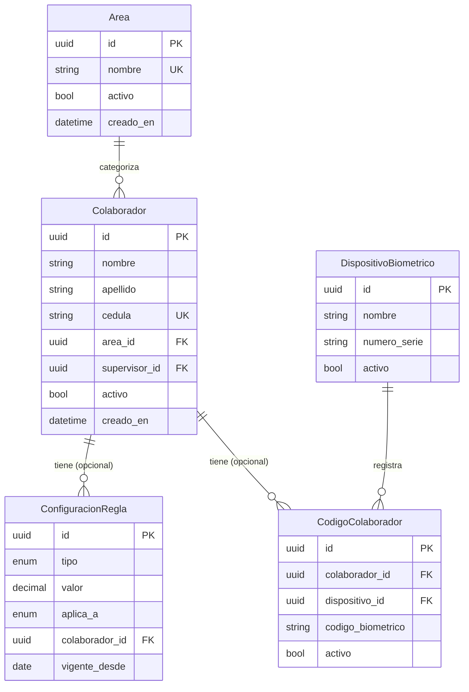

# Data Model: Registro de Colaborador

**Feature**: 004-register-employee | **Date**: 2026-05-25
**Base**: `specs/003-mvp-data-model/data-model.md` v2.0

---

## Enmienda al Modelo Base

Esta feature introduce **una nueva tabla** y **un nuevo campo** al modelo aprobado en spec 003.

| Cambio | Tipo | Tabla afectada | Campo |
|--------|------|----------------|-------|
| Nueva tabla `areas` | Adición | — | — |
| FK `area_id` en `colaboradores` | Adición de campo | `colaboradores` | `area_id UUID REFERENCES areas(id)` |

La enmienda es compatible con el modelo v2.0: solo agrega, no modifica estructuras existentes.

---

## Nueva Tabla: `areas`

Catálogo de áreas de trabajo. Administrada por el sistema; las áreas se gestionan por seed inicial o CRUD de administración (fuera del alcance de esta feature).

| Campo | Tipo DB | Nullable | Único | Default | Descripción |
|-------|---------|----------|-------|---------|-------------|
| `id` | `UUID` | No | Sí (PK) | `gen_random_uuid()` | Identificador único |
| `nombre` | `TEXT` | No | Sí | — | Nombre del área (ej. "Producción", "Bodega") |
| `activo` | `BOOLEAN` | No | No | `true` | Soft delete |
| `creado_en` | `TIMESTAMPTZ` | No | No | `now()` | — |

**SQL de creación**:
```sql
CREATE TABLE areas (
  id UUID PRIMARY KEY DEFAULT gen_random_uuid(),
  nombre TEXT NOT NULL UNIQUE,
  activo BOOLEAN NOT NULL DEFAULT true,
  creado_en TIMESTAMPTZ NOT NULL DEFAULT now()
);
```

---

## Enmienda: `colaboradores`

Agregar FK `area_id` nullable (permite migrar sin bloquear datos existentes).

```sql
ALTER TABLE colaboradores
  ADD COLUMN area_id UUID REFERENCES areas(id) ON DELETE SET NULL;
```

**Campo añadido**:

| Campo | Tipo DB | Nullable | Default | Descripción |
|-------|---------|----------|---------|-------------|
| `area_id` | `UUID` | Sí | `null` | FK → `areas.id`. Área de trabajo del colaborador |

**Nota**: Se define como nullable para que la migración no bloquee registros existentes. Desde la perspectiva de la feature 004, `area_id` es requerido en el formulario de registro (validación en backend), pero la BD lo acepta nulo para compatibilidad histórica.

---

## Tablas existentes usadas por esta feature

### `colaboradores` (post-enmienda)

Campos relevantes para el registro:

| Campo | Tipo DB | Nullable | Descripción |
|-------|---------|----------|-------------|
| `id` | `UUID` | No | PK |
| `nombre` | `TEXT` | No | Nombre(s) del colaborador |
| `apellido` | `TEXT` | No | Apellido(s) del colaborador |
| `cedula` | `TEXT` | No (UNIQUE) | Cédula de identidad |
| `area_id` | `UUID` | Sí | FK → `areas.id` *(enmienda)* |
| `supervisor_id` | `UUID` | Sí | FK → `usuarios.id` |
| `activo` | `BOOLEAN` | No | `true` al crear |

**Constraint unicidad cédula**: `UNIQUE (cedula)` — aplica sin filtro de estado activo/inactivo.

---

### `configuraciones_reglas`

Usada para registrar la tarifa horaria y el horario laboral del colaborador (opcionales).

**Registros creados por esta feature** (si el admin los configura):

| tipo | clave | valor | unidad | aplica_a | colaborador_id | vigente_desde |
|------|-------|-------|--------|----------|----------------|---------------|
| `TARIFA_HORA` | "Tarifa hora ordinaria" | `<monto COP>` | `COP` | `COLABORADOR` | `<id>` | fecha de registro |
| `UMBRAL_HORA_EXTRA` | "Umbral horas extra diarias" | `<horas>` | `horas` | `COLABORADOR` | `<id>` | fecha de registro |

Si no se configuran, el motor de liquidación hará lookup en las reglas con `aplica_a = GLOBAL` al momento de calcular.

---

### `codigos_colaborador`

Usada para asignar el código biométrico (workno) al colaborador en un dispositivo específico.

| Campo | Valor al crear |
|-------|----------------|
| `colaborador_id` | `<id del nuevo colaborador>` |
| `dispositivo_id` | Seleccionado en el wizard |
| `codigo_biometrico` | workno ingresado por el admin |
| `activo` | `true` |

**Constraint**: `UNIQUE (dispositivo_id, codigo_biometrico)` — rechaza asignación de workno duplicado en el mismo dispositivo con error `23505`.

---

### `registros_auditoria`

Registro de auditoría al completar el registro (FR-010).

| Campo | Valor |
|-------|-------|
| `accion` | `COLABORADOR_REGISTRADO` |
| `entidad_tipo` | `Colaborador` |
| `entidad_id` | ID del colaborador creado |
| `usuario_id` | ID del admin autenticado |
| `datos_nuevos` | JSON con colaborador + configuraciones + códigos |
| `descripcion` | `"Registro de nuevo colaborador: {nombre} {apellido}"` |

---

## Diagrama de entidades (esta feature)



---

## Seed de áreas iniciales

```sql
INSERT INTO areas (nombre) VALUES
  ('Producción'),
  ('Bodega'),
  ('Administración'),
  ('Seguridad'),
  ('Mantenimiento')
ON CONFLICT (nombre) DO NOTHING;
```

El administrador puede solicitar la adición de nuevas áreas (fuera del alcance de esta feature).
