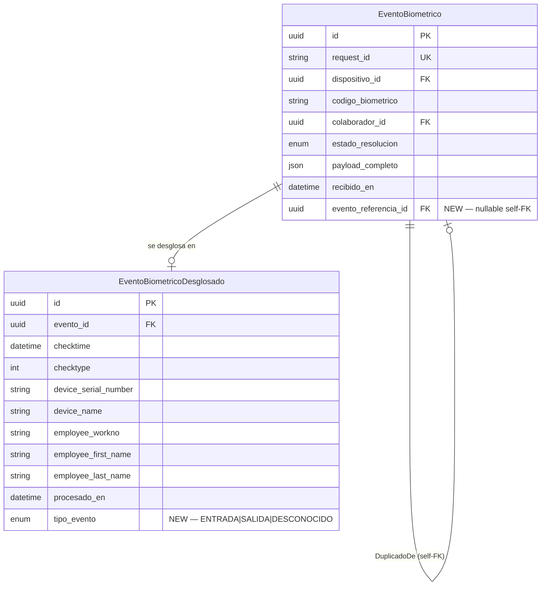

# Data Model: Control de Eventos Biométricos Duplicados

**Feature**: 011-attendance-dedup | **Date**: 2026-05-22
**Base model**: specs/003-mvp-data-model/data-model.md

---

## Resumen de Enmiendas al Modelo Base (spec 003)

Esta feature requiere **cuatro enmiendas** al modelo de datos existente, todas additive (no destructivas):

| Enmienda | Entidad | Tipo de cambio |
|----------|---------|----------------|
| 1 | `EstadoResolucion` enum | Añadir 2 valores: `POTENCIAL_DUPLICADO`, `DUPLICADO` |
| 2 | `eventos_biometricos` | Añadir columna nullable: `evento_referencia_id` (UUID, self-FK) |
| 3 | `eventos_biometricos_desglosados` | Añadir columna con default: `tipo_evento` (TipoEvento enum) |
| 4 | `TipoConfiguracion` enum | Añadir 1 valor: `DEDUP_WINDOW_MINUTES` |

---

## Enmienda 1 — Enum `EstadoResolucion`

**Cambio**: Agregar `POTENCIAL_DUPLICADO` y `DUPLICADO`.

```prisma
enum EstadoResolucion {
  RESUELTO             // Evento vinculado a colaborador, válido, incluido en cálculos
  SIN_RESOLVER         // Sin colaborador asignado — pendiente de asociación
  DISPOSITIVO_DESCONOCIDO  // Dispositivo origen no registrado
  POTENCIAL_DUPLICADO  // NEW: Flaggeado por deduplicación automática; incluido en cálculos hasta descarte
  DUPLICADO            // NEW: Descartado manualmente; excluido de cálculos y liquidaciones
}
```

**Máquina de estados**:

```
SIN_RESOLVER ──── [colaborador resuelto] ──────────────────────────► RESUELTO
                                                                        │
                                                          [dedup detecta candidato]
                                                                        │
                                                                        ▼
                                                            POTENCIAL_DUPLICADO
                                                           ╱                    ╲
                               [confirmar como válido]   ╱                      ╲  [descarte manual]
                                                        ╱                        ╲
                                                    RESUELTO                  DUPLICADO
                                                    (válido)                 (excluido)

DISPOSITIVO_DESCONOCIDO  ── (terminal, no avanza)
```

**Regla de cálculo**: Solo se incluyen en cálculos de horas y liquidaciones los eventos con `estado_resolucion = RESUELTO` o `POTENCIAL_DUPLICADO`. Los estados `DUPLICADO`, `SIN_RESOLVER`, `DISPOSITIVO_DESCONOCIDO` se excluyen.

---

## Enmienda 2 — Tabla `eventos_biometricos` (nueva columna)

**Cambio**: Añadir `evento_referencia_id`.

| Campo | Tipo DB | Prisma | Nullable | Único | Default | Descripción |
|-------|---------|--------|----------|-------|---------|-------------|
| `evento_referencia_id` | `UUID` | `String? @db.Uuid` | Sí | No | `null` | FK → `eventos_biometricos.id`. Referencia al evento original del cual este es potencial duplicado. Solo presente cuando `estado_resolucion = POTENCIAL_DUPLICADO \| DUPLICADO`. |

**Relación Prisma** (self-referencial nombrada):

```prisma
model EventoBiometrico {
  // ... campos existentes ...
  estado_resolucion      EstadoResolucion    @default(SIN_RESOLVER)
  evento_referencia_id   String?             @db.Uuid
  evento_referencia      EventoBiometrico?   @relation("DuplicadoDe", fields: [evento_referencia_id], references: [id])
  eventos_derivados      EventoBiometrico[]  @relation("DuplicadoDe")
}
```

**Invariante**: Si `estado_resolucion = POTENCIAL_DUPLICADO | DUPLICADO`, entonces `evento_referencia_id != null`. Enforced a nivel de servicio.

---

## Enmienda 3 — Tabla `eventos_biometricos_desglosados` (nueva columna)

**Cambio**: Añadir `tipo_evento`.

| Campo | Tipo DB | Prisma | Nullable | Único | Default | Descripción |
|-------|---------|--------|----------|-------|---------|-------------|
| `tipo_evento` | `TipoEvento` (enum) | `TipoEvento` | No | No | `DESCONOCIDO` | Dirección del marcaje: ENTRADA (io=0), SALIDA (io=1), DESCONOCIDO si el dispositivo no envía campo `io`. |

**Nuevo enum**:

```prisma
enum TipoEvento {
  ENTRADA       // io = 0 en CrossChex, o "IN" en CSV
  SALIDA        // io = 1 en CrossChex, o "OUT" en CSV
  DESCONOCIDO   // Dispositivo no diferencia dirección
}
```

**Lógica de extracción desde CrossChex**: El campo `io` del payload CrossChex contiene `0` (ENTRADA) o `1` (SALIDA). Si el campo está ausente o no es 0/1, se usa `DESCONOCIDO`.

**Nota**: Los eventos con `tipo_evento = DESCONOCIDO` no participan en la detección de duplicados por tipo (FR-002, Assumption del spec). Limitación de hardware.

---

## Enmienda 4 — Enum `TipoConfiguracion`

**Cambio**: Añadir `DEDUP_WINDOW_MINUTES`.

```prisma
enum TipoConfiguracion {
  TARIFA_HORA
  TARIFA_HORA_EXTRA
  UMBRAL_HORA_EXTRA
  BONO_TRANSPORTE_CRITERIO
  BONO_ALIMENTACION_CRITERIO
  DESCUENTO
  DEDUP_WINDOW_MINUTES   // NEW: Ventana de deduplicación en minutos. aplica_a=GLOBAL, valor=2 por defecto.
}
```

**Registro de configuración default**:

```sql
INSERT INTO configuraciones_reglas (tipo, clave, valor, unidad, aplica_a, vigente_desde)
VALUES ('DEDUP_WINDOW_MINUTES', 'Ventana de deduplicación', 2, 'minutos', 'GLOBAL', CURRENT_DATE);
```

---

## Diagrama de Cambios (diff sobre ERD de spec 003)



---

## Consulta de Detección de Duplicado

El `DeduplicationService` ejecuta la siguiente consulta para cada evento recién resuelto:

```sql
SELECT id, evento_referencia_id
FROM eventos_biometricos eb
JOIN eventos_biometricos_desglosados ebd ON ebd.evento_id = eb.id
WHERE eb.colaborador_id = :colaborador_id
  AND ebd.tipo_evento = :tipo_evento             -- ENTRADA o SALIDA
  AND eb.estado_resolucion = 'RESUELTO'          -- Solo eventos válidos como referencia
  AND ebd.checktime >= :checktime_nuevo - (INTERVAL '1 minute' * :ventana_minutos)
  AND ebd.checktime < :checktime_nuevo           -- Anterior al evento a clasificar
ORDER BY ebd.checktime DESC
LIMIT 1;
```

Si retorna un resultado → el nuevo evento es `POTENCIAL_DUPLICADO`; `evento_referencia_id` = `id` del resultado.

**Índice recomendado** (a crear en migración):
```sql
CREATE INDEX idx_eventos_bio_dedup
ON eventos_biometricos_desglosados (evento_id)
INCLUDE (checktime, tipo_evento);

CREATE INDEX idx_eventos_bio_colaborador_estado
ON eventos_biometricos (colaborador_id, estado_resolucion);
```

---

## Consulta de Exclusión en Cálculo de Horas (integración con spec 006)

La query base de spec 006 que obtiene eventos para el cálculo pasa de:
```sql
WHERE eb.colaborador_id = :id
  AND eb.estado_resolucion = 'RESUELTO'
```

A:
```sql
WHERE eb.colaborador_id = :id
  AND eb.estado_resolucion IN ('RESUELTO', 'POTENCIAL_DUPLICADO')
  -- DUPLICADO, SIN_RESOLVER, DISPOSITIVO_DESCONOCIDO quedan excluidos
```

Nota: `POTENCIAL_DUPLICADO` se incluye intencionalmente — el evento sigue en cálculos hasta descarte manual (FR-005).
